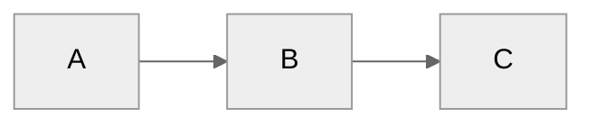

---
puppeteer:
    author: 连玉君
    scale: 0.8           # 页面缩放    
    margin:
        top: 2cm
        bottom: 2cm
        right: 3cm
        left: 3cm
    timeout: 3000        # 延迟 3000 毫秒输出 HTML，进而转换为 PDF
    displayHeaderFooter: true
    headerTemplate: '<span class="pageNumber"></span>'
    footerTemplate: '
        <div style="font-size: 10px; margin-left: 20px;">
        <span class="pageNumber"></span> / 
        <span class="totalPages"></span>
        </div>
        '
---

# mermaid 使用笔记

[toc]

## 参考资料
- Mermaid 官网：[Diagramming and charting tool](http://mermaid.js.org/intro/)
  - 提供了语法基础，常用图形的绘制案例
  - 在线绘制 Mermaid：<https://mermaid.live/>
  - [github](https://github.com/mermaid-js/mermaid)
- 知乎，[Markdown 进阶技能：用代码画流程图](https://zhuanlan.zhihu.com/p/69495726)
- [Mermaid语法大全](https://blog.csdn.net/weixin_45017098/article/details/131189766)，这个非常全面
- 在线编写并输出为图片
  - <https://mermaid.live/>
- 形状和模板
  - [Mermaid 官网 - Flowchart](https://mermaid.js.org/syntax/flowchart.html)
- **Quarto**
  - [Quarto - Mermaid and Graphviz diagrams](https://quarto.org/docs/authoring/diagrams.html), 介绍了如何定制 mermaid 图形的模板等内容。

### Graphviz Interactive Preview

- 可以绘制因果图等
- 安装：在 VScode 中搜索关键词 `graphviz`，安装如下插件：
  - `Graphviz Interactive Preview`， [github](https://github.com/tintinweb/vscode-interactive-graphviz)
  - `Graphviz (dot) language support for Visual Studio Code`
    - [github-vscode-graphviz](https://github.com/joaompinto/vscode-graphviz)


## 简单示例


## 安装和应用环境

### Typora 
- 无需安装任何插件，因为 Typora 自带 mermaid 功能。 
- 语法结构与在 VScode 中完全一致，因此，可以将 VScode 中写好的 Markdown 文档，用 Typora 转换为 PDF 或 Word 文档。 

### VScode 
- 安装插件：按快捷键 **Ctrl+Shift+X**，搜索 `mermaid`，根据需要安装相关插件。推荐如下两个基本插件
  - `Markdown Preview Mermaid Support`，用于转换 Mermaid 对象
  - `vscode-mermaid-syntax-highlight`，语法高亮
- 制作 Mermaid 图形：将 mermaid 代码用代码块包围，即：
   ~~~md
   ```mermaid
   graph LR
     ...
   ```
   ~~~~

### Marp 

参考资料：
- [Integrating Mermaid diagrams into Markdown slides](https://github.com/hakimel/reveal.js/issues/1082)
- mermaid 官网：[Requirements for the Mermaid API.](https://mermaid.js.org/intro/getting-started.html)

使用 [Marp](https://www.lianxh.cn/news/148555c4f20ce.html) 插件制作幻灯片时，需要用 `<div class="mermaid">` 和 `</div>` 包围 mermaid 代码。


::: {.callout-warning}
## 特别注意
`A[文字]` 不能写成 `A [文字]` (标记和文字之间不能有空格)
:::


### Qaurto 

Quarto (@sec-quarto-01-intro) 已经内置了 mermaid 功能，因此无需安装任何插件。

在 Qaurto 中使用 mermaid 的语法与上文介绍的内容基本一致，更多设定参见 [Quarto - Diagrams](https://quarto.org/docs/authoring/diagrams.html)。

### 方向标记

### 图形标记
> 不使用图形则会直接显示文本
```Stata
[]   表示方形文本框
{}   表示菱形文本框
()   表示圆角方形文本框
(()) 表示圆形文本框
```

**示例：**
~~~md
graph LR
  A[长方形] -.- B((圆形))
  A ==> B
  A === C(圆角长方形)
  B --> D{菱形}
  C --> D
~~~


### 连线标记
> 连接线重复多个 - 或者 = 能增加线的长度
```R
--   实线不带箭头   示例: A -- B
-->  实线带箭头     示例: A  -- B
-.-  虚线不带箭头   示例: A -.- B
-.-> 虚线带箭头     示例: A -.-> B
===  粗线不带箭头   示例: A === B
==>  粗线带箭头     示例: A ==> B
```

**示例：**
~~~md
graph LR
A -- B --> C -.- D -.-> E === F ==> G
~~~

## 风格/主题 - theme
共有四种主题可以选择 (`default`, `forest`, `dark`, `neutral`) (参见 [Mermaid’s Themes](https://quarto.org/docs/authoring/diagrams.html)，该文档中还介绍了如何自定义其他 themes)，可以在文档顶部以 YAML 格式指定 (在 MPE 中似乎无法生效)，也可以在具体的图形中单独设定。 


~~~md

~~~


~~~md

~~~


~~~md

~~~


## 输出 PDF 

- 一种方式是 Typora 中转，但有些 mermaid 代码在 Typora 中无法识别，或者需要用比较繁琐的语法来写。 
- 另一种方法是借助 VScode 插件 **markdown Preview Enhanced**。

### 使用插件 markdown Preview Enhanced

> Source: https://github.com/yzane/vscode-markdown-pdf/issues/204

TODO: 还需对插件的 .json 文件进行设置，或者添加头部信息，以便控制页面宽度，页眉等信息。一旦设定好这个，日后就不用再使用 Typora 作为中转工具了。 
- <https://shd101wyy.github.io/markdown-preview-enhanced/#/zh-cn/puppeteer?id=%e8%ae%be%e7%bd%ae-puppeteer>

Here is my workaround.

1. Install "markdown Preview Enhanced" on VSC.
2. Right click on the markdown text file, and then, "Open Preview to the Slide"
3. Now you have the preview with mermaid diagram.
4. Right click on the preview, then select "Chrome (Pupperteer) - PDF" 1 or "Open in Browser"$^2$

1 PDF will be directly created to your folder.
2 The output image will be shown on your browser, and use Print to PDF function.
