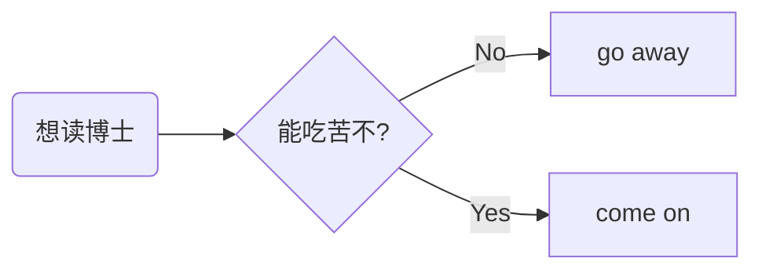
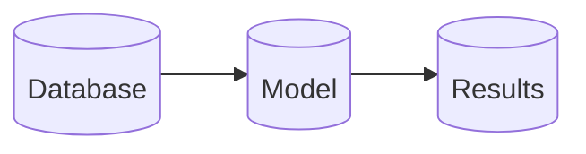
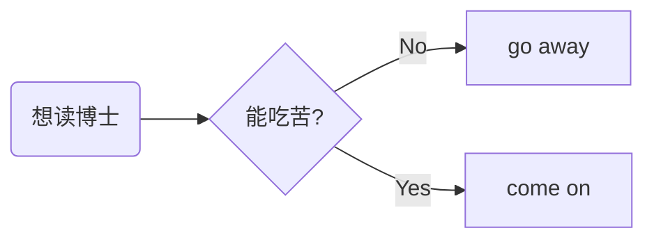
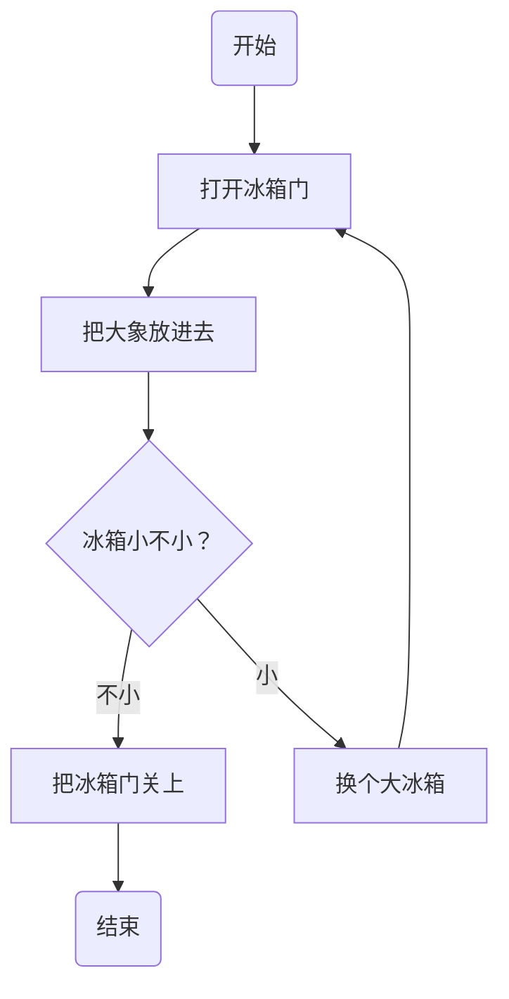
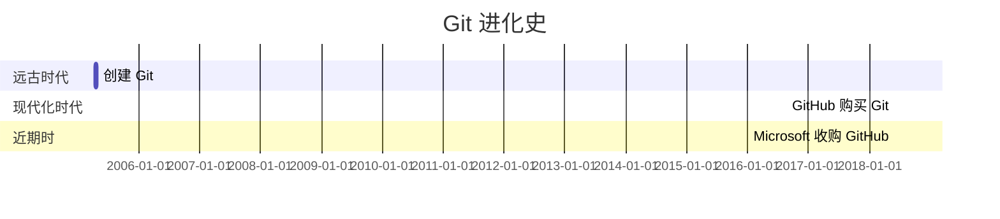
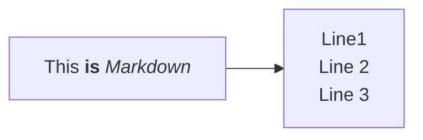
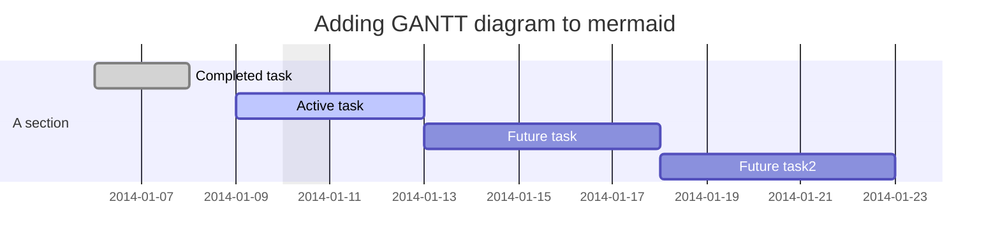
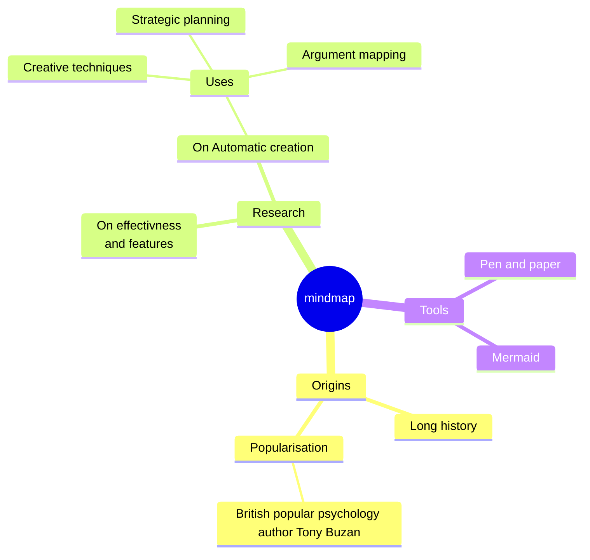
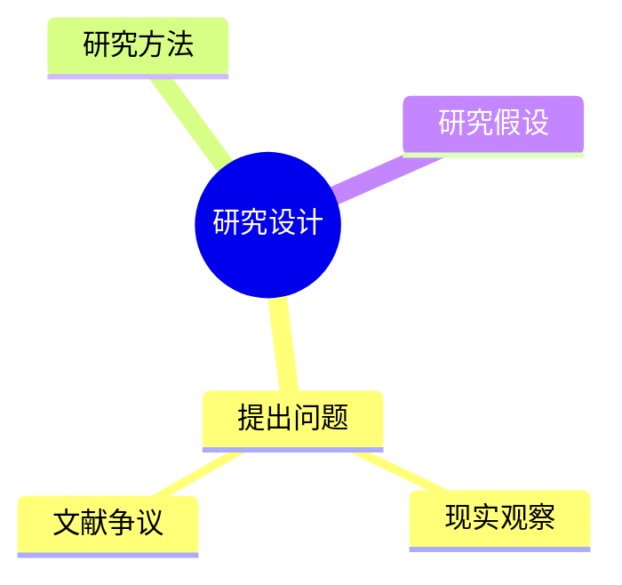

# mermaid: 思维导图插件

## 简单示例


## 安装和应用环境

### 在线编写并输出为图片

- <https://mermaid.live/>

### Typora 
- 无需安装任何插件，因为 Typora 自带 mermaid 功能。 
- 语法结构与在 VScode 中完全一致，因此，可以将 VScode 中写好的 Markdown 文档，用 Typora 转换为 PDF 或 Word 文档。 

### VScode 
- 安装插件：按快捷键 **Ctrl+Shift+X**，搜索 `mermaid`，根据需要安装相关插件。推荐如下两个基本插件
  - `Markdown Preview Mermaid Support`，用于转换 Mermaid 对象
  - `vscode-mermaid-syntax-highlight`，语法高亮
- 制作 Mermaid 图形：将 mermaid 代码用代码块包围，即头部为 **```mermaid**，尾部为 **\`\`\`**
  ````md
  ```mermaid
     codes
  ```
  ````

### Quarto
- [Quarto - Mermaid and Graphviz diagrams](https://quarto.org/docs/authoring/diagrams.html)

### Marp 
使用 [Marp](https://www.lianxh.cn/news/148555c4f20ce.html) 插件制作幻灯片时，需要用 `<div class="mermaid">` 和 `</div>` 包围 mermaid 代码。


> 参考资料：

- [Integrating Mermaid diagrams into Markdown slides](https://github.com/hakimel/reveal.js/issues/1082)

````md
```html
<div class="mermaid">
graph LR 
    Start(想读博士) --> IsFile{能吃苦不?}
    IsFile -->| No | A[go away]
    IsFile -->| Yes| B[come on]
</div>
```
````

输出效果：




## 参考资料
- Mermaid 官网：[Diagramming and charting tool](http://mermaid.js.org/intro/)
  - 提供了语法基础，常用图形的绘制案例
  - 在线绘制 Mermaid：<https://mermaid.live/>
  - [github](https://github.com/mermaid-js/mermaid)
- 知乎，[Markdown 进阶技能：用代码画流程图](https://zhuanlan.zhihu.com/p/69495726)
- [Mermaid 语法大全](https://blog.csdn.net/weixin_45017098/article/details/131189766)，这个非常全面


## 形状和模板

> Source: [Mermaid 官网 - Flowchart](https://mermaid.js.org/syntax/flowchart.html)


````md

````





## 简单示例



## 进化图
> Source: [Mermaid语法大全](https://blog.csdn.net/weixin_45017098/article/details/131189766)


1. `title`：定义 Git 图的标题。
2. `dateFormat`：定义日期格式。
3. `section`：定义不同时间段。
4. 使用 `:` 分隔任务名称和 ID。
5. 使用 `,` 分隔任务 ID、开始日期和持续天数。

## Flow Chart



## Gantt diagram
> Source: [Mermaid: Diagramming and charting tool](http://mermaid.js.org/intro/)
Code:

## 



